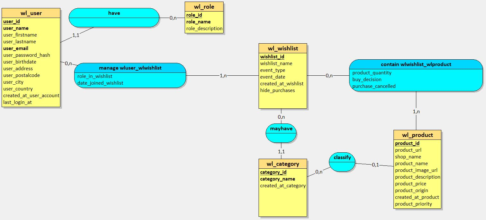
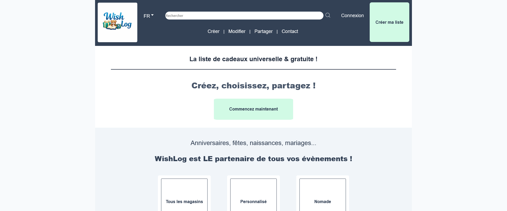

# Projet Fil Rouge

## Titre : WishLog

## Description de WishLog

WishLog est une application web développée en HTML, CSS, JavaScript, PHP et MySQL permettant de créer une liste d'achat (aussi appelée liste d'envies) à partir de produits mis en vente sur tous types de sites de e-commerce. 

## Compétences visées

### Réaliser des interfaces utilisateur statiques web ou web mobile

Développement de pages web en utilisant :

- Figma (facultatif)
- HTML5
- CSS3
- Compréhension de la mise en page responsive.

Exemple : Codage en HTML5 et CSS3 pour structurer des pages web et appliquer des styles.

### Développer la partie dynamique des interfaces utilisateur web ou web mobile

- Programmation en JavaScript
- ~~Utilisation de bibliothèques et frameworks pour enrichir l'interaction utilisateur.~~

Exemple : Utilisation de JavaScript pour rendre les interfaces interactives.

### Développer la partie back-end d'une application web ou web mobile sécurisée

Développement de pages web en utilisant :

- MySQL
- PHP

#### Conception de la base de données (Merise)

##### MCD - Modèle Conceptuel de Données



##### MLD - Modèle Logique de Données


##### MPD- Modèle Physique de Données


## Captures d'écran ou GIF de démonstration



## Structure du projet (arborescence des fichiers)

lamp-server/                        # Environnement Docker
├── .env                            # Variables d'environnement (exclu de Git)
├── .gitignore
├── docker-compose.yml              # Configuration des conteneurs Docker
├── Dockerfile.php                  # Image PHP/Apache
├── apache-config/
│   └── localhost.conf
└── www/
    └── wishlog/                    # Code source de l'application
        ├── config/
        │   └── database.php        # Connexion PDO à la BDD
        ├── css/
        │   └── style.css
        ├── docs/                   # MCD, MLD, MPD
        ├── images/                 # Images utilisées pour le site
        ├── includes/
        │   ├── head.php
        │   ├── header.php
        │   ├── footer.php
        │   └── traitement.php
        ├── js/
        │   ├── darkmode.js
        │   └── wishlist.js
        ├── sql/
        │   └── wishlog_dev.sql
        ├── .env.example
        ├── .gitignore
        ├── 404.php
        ├── index.php
        ├── addproduct.php
        ├── contact.php
        ├── createwishlist.php
        ├── login.php
        ├── signup.php
        ├── wishlist.json
        ├── wishlist.php
        └── README.md

## Technologies utilisées

- HTML5
- CSS3
- JavaScript (vanilla)
- Looping
- MySQL 8.4.8
- PHP 8.2.29
- Docker (environnement de développement)
- Apache 2.4.65
- PHPMyAdmin
- PDO

## Fonctionnalités principales

### Accès et profil
- Créer des accès administrateur (MVP)
- Créer des accès éditeur (MVP)
- Créer un compte utilisateur (MVP)
- Connexion de l'utilisateur (MVP)
- Récupération de mot de passe (MVP)
- Modifier les paramètres du compte (MVP)
- Supprimer son compte (MVP)

### Environnement utilisateur
- Créer une page de profil / tableau de bord (MVP)
- Créer une liste (MVP)
- Modifier une liste (MVP)
- Supprimer une liste (MVP)
- Organiser les listes
- Ajouter un article (MVP)
- Modifier un article (MVP)
- Supprimer un article (MVP)
- Créer manuellement un article si import impossible (MVP)
- Afficher les articles
- Partager la liste : URL / mail / RS (MVP)
- Créer une fonction "ne pas me gâcher la surprise"

### Personnalisation des listes
- Créer des catégories pour filtrer les articles au sein de la liste (prix, priorité, type si renseigné, dernier ajout)
- Organiser manuellement les articles dans la liste pour personnaliser au maximum : glisser-déposer ou saisie du numéro auquel on veut placer l'article (le reste se réarrange en-dessous de l'article une fois qu'il est positionné) pour éviter des glisser-déposer fastidieux quand la liste est longue
- Personnalisation de l'interface (photo, url customisée)

## Instructions d'installation (si applicable)
Projet Front-End : Aucune installation nécessaire. Le site est accessible directement en ligne via GitHub Pages.
Pour le projet complet : 

### Prérequis
- Docker Desktop installé et en cours d'exécution
- Git

### Étapes

#### **Configurer l'environnement** TODO : ajouter la bonne URL quand elle sera disponible
Cloner le dépôt dans le dossier `lamp-server/www/` :
```bash
cd lamp-server/www
git clone https://github.com/tonusername/wishlog.git 
```
Puis copier le fichier `.env.example` à la racine de `lamp-server` et le renommer `.env` :
```bash
cp wishlog/.env.example ../.env
```
Modifier ensuite le fichier `.env` avec vos propres valeurs.

#### **Démarrer les conteneurs Docker**
```bash
cd lamp-server
docker-compose up -d
```

#### **Importer la base de données**
- Ouvrir phpMyAdmin à l'adresse `http://localhost/phpmyadmin`
- Importer le fichier `sql/SEGUI_BILGER_Sarah_ECF-7.2_script.sql`

#### **Accéder à l'application**
Ouvrir le navigateur à l'adresse `http://localhost`


## Lien vers le site déployé
J’ai utilisé GitHub Pages pour héberger un site statique. Mon code est versionné avec Git, poussé sur GitHub, et GitHub Pages publie automatiquement la branche main.
Adresse du site hébergé via GitHub Pages : https://lexaframe.github.io/wishlog/

## Choix de conception et notes explicatives
Le site a été développé pour être responsive.
Les mots de passe des données de test sont des placeholders — générer de nouveaux hashs avec password_hash() avant utilisation.

## Auteur, date de création, droit d'auteur

Auteur : Sarah Segui Bilger
Date de création : 15/12/2025  

Projet réalisé par **Sarah Segui Bilger** dans le cadre d'une formation en développement web.
Dépôt rendu public uniquement à des fins pédagogiques.

Les clés et données sensibles ont été volontairement retirées.

Toute réutilisation sans autorisation est interdite.

--

# Training Project

## Title : WishLog

## WishLog description

WishLog is a web application developed using HTML, CSS, JavaScript, PHP and MySQL that allows users to create a shopping list (also called a wishlist) from products sold on any type of e-commerce website.

## Targeted Skills

### Build static web or mobile web user interfaces

Development of web pages using:

- Figma (optional)
- HTML5
- CSS3
- Understanding responsive layout design

Example: Writing HTML5 and CSS3 code to structure web pages and apply styling.

### Develop the dynamic part of web or mobile web user interfaces

- JavaScript programming
- Use of libraries and frameworks to enhance user interaction

Example: Using JavaScript to make interfaces interactive.

### Develop the back-end part of a secure web or mobile web application

Development of web applications using:

- MySQL
- PHP

#### Database Conception (Merise)

##### CDM - Conceptual Data Model


##### LDM - Logical Data Model


##### PDM - Physical Data Model


## Screenshots or Demo GIFs


## Project Structure (File Tree)

lamp-server/                        # Docker environment
├── .env                            # Environment variables (excluded from Git)
├── .gitignore
├── docker-compose.yml              # Docker containers configuration
├── Dockerfile.php                  # PHP/Apache image
├── apache-config/
│   └── localhost.conf
└── www/
    └── wishlog/                    # Application source code
        ├── config/
        │   └── database.php        # PDO database connection
        ├── css/
        │   └── style.css
        ├── docs/                   # MCD, MLD, MPD
        ├── images/                 # Website images
        ├── includes/
        │   ├── head.php
        │   ├── header.php
        │   ├── footer.php
        │   └── traitement.php
        ├── js/
        │   ├── darkmode.js
        │   └── wishlist.js
        ├── sql/
        │   └── wishlog_dev.sql
        ├── .env.example
        ├── .gitignore
        ├── 404.php
        ├── index.php
        ├── addproduct.php
        ├── contact.php
        ├── createwishlist.php
        ├── login.php
        ├── signup.php
        ├── wishlist.json
        ├── wishlist.php
        └── README.md

## Technologies Used

- HTML5
- CSS3
- JavaScript (vanilla)
- Looping
- MySQL 8.4.8
- PHP 8.2.29
- Docker (development environment)
- Apache 2.4.65
- phpMyAdmin
- PDO

## Main Features

### Access and profile

- Create administrator access (MVP)
- Create editor access (MVP)
- Create a user account (MVP)
- User login (MVP)
- Password recovery (MVP)
- Modify account settings (MVP)
- Delete account (MVP)

### User environment

- Create a profile page / dashboard (MVP)
- Create a list (MVP)
- Edit a list (MVP)
- Delete a list (MVP)
- Organize lists
- Add an item (MVP)
- Edit an item (MVP)
- Delete an item (MVP)
- Manually create an item if import is not possible (MVP)
- Display items
- Share the list: URL / email / social networks (MVP)
- Create a "don't spoil the surprise" feature

### List customization

- Create categories to filter items within the list (price, priority, type if specified, most recent addition)
- Manually organize items within the list for maximum customization: drag-and-drop or entering the position number where the item should be placed (other items automatically shift below it once positioned) to avoid tedious drag-and-drop when the list is long
- Interface customization (photo, custom URL)

## Installation Instructions (if applicable)

Front-End version only : No installation required. The website is directly accessible online via GitHub Pages.

For the full project : 

### Prerequisites
- Docker Desktop installed and running
- Git

### Steps

#### **Environment setup** TODO : change the URL when the right one is available :

Clone the repository into the `lamp-server/www/` folder:
```bash
cd lamp-server/www
git clone https://github.com/tonusername/wishlog.git
```
Then copy the `.env.example` file to the root of `lamp-server` and rename it `.env`:
```bash
cp wishlog/.env.example ../.env
```
Then edit the `.env` file with your own values.

#### **Start the Docker containers**
```bash
cd lamp-server
docker-compose up -d
```

#### **Import the database**
- Open phpMyAdmin at `http://localhost/phpmyadmin`
- Import the file `sql/SEGUI_BILGER_Sarah_ECF-7.2_script.sql`

#### **Access the application**
Open your browser at `http://localhost`

## Link to the deployed site

I used GitHub Pages to host a static website. My code is versioned with Git, pushed to GitHub, and GitHub Pages automatically publishes the main branch.

Website hosted via GitHub Pages: [URL](https://lexaframe.github.io/wishlog/)

## Design choices and explanatory notes

The website was developed to be responsive.
The test passwords are placeholders — generate new hashes with password_hash() before use.

## Author, creation date, copyright

Author: Sarah Segui Bilger
Creation date: 15/12/2025

Project created by Sarah Segui Bilger as part of a web development training program.
The repository is made public for educational purposes only.

Keys and sensitive data have been intentionally removed.

Any reuse without authorization is prohibited.

## Legal notice - ENGLISH / TODO : ajouter une version française

This project was created by **Sarah Segui Bilger** as part of a web development training program.

The repository is made public solely to comply with educational requirements.
All rights are reserved. Any reproduction, modification, distribution or reuse
of the code, in whole or in part, without explicit prior written permission
from the author is prohibited.